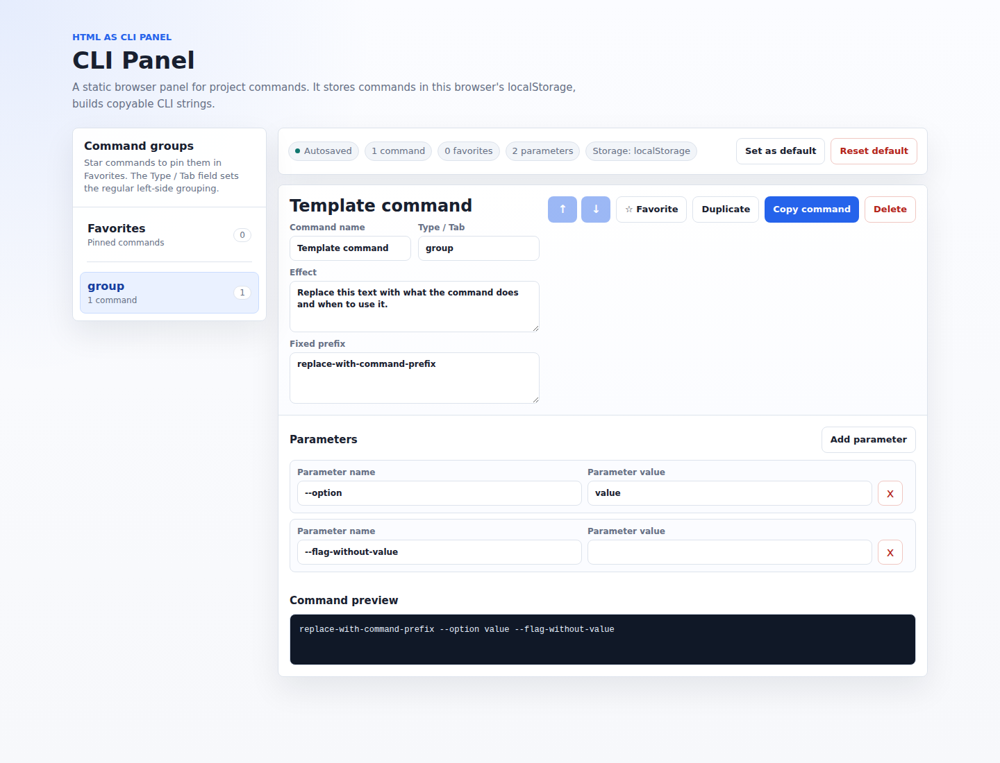

# HTML as CLI Panel

An agent skill for creating a static, copy-only HTML command panel from a
project's repeat-use CLI workflows.

<p align="center">
  <a href="https://skills.sh/rob163/html-as-cli-panel-skill"></a>
  <a href="https://github.com/rob163/html-as-cli-panel-skill/blob/main/LICENSE"></a>
</p>

The generated `cli-panel.html` runs locally in the browser, stores edits in
`localStorage`, and helps users build copyable commands without adding runtime
dependencies to the target project.

<p align="center">
  <a href="https://rob163.github.io/html-as-cli-panel-skill/demo/cli-panel.html">
    
  </a>
</p>

<p align="center">
  <a href="https://rob163.github.io/html-as-cli-panel-skill/demo/cli-panel.html"><strong>Open the live template demo</strong></a>
</p>

## Install

[skills](https://skills.sh) is the CLI for the open agent skills ecosystem. It
downloads a skill from a GitHub repository and places it in the directory your
coding agent expects (for example `~/.cursor/skills/` or `.codex/skills/`). You
do not need to install it separately — `npx skills` runs it on demand.

Use the installer so the target agent receives the correct layout. This avoids
fragile file-placement mistakes.

### skills CLI

Install into the current project:

```bash
npx skills add rob163/html-as-cli-panel-skill
```

Install for a specific agent:

```bash
npx skills add rob163/html-as-cli-panel-skill --agent codex
npx skills add rob163/html-as-cli-panel-skill --agent claude-code
```

Install globally instead of project-local:

```bash
npx skills add rob163/html-as-cli-panel-skill --global --agent codex
npx skills add rob163/html-as-cli-panel-skill --global --agent claude-code
```

Skip confirmation prompts when installing in scripts:

```bash
npx skills add rob163/html-as-cli-panel-skill --global --agent codex --yes
```

Verify installation:

```bash
npx skills ls -g -a codex
```

### Codex plugin

Codex can install this repository as a plugin marketplace. This path uses the
checked-in `.agents/plugins/marketplace.json` and
`plugins/html-as-cli-panel-skill/.codex-plugin/plugin.json`
files, which expose the same `cli-panel` skill through Codex's plugin system.

```bash
codex plugin marketplace add rob163/html-as-cli-panel-skill
codex plugin add html-as-cli-panel-skill@html-as-cli-panel-skill
```

For a local clone:

```bash
git clone https://github.com/rob163/html-as-cli-panel-skill
codex plugin marketplace add ./html-as-cli-panel-skill
codex plugin add html-as-cli-panel-skill@html-as-cli-panel-skill
```

Restart Codex or start a new thread if the installed skill does not appear
immediately.

### Claude Code plugin

Install as a versioned Claude Code plugin from inside Claude Code:

```text
/plugin marketplace add rob163/html-as-cli-panel-skill
/plugin install html-as-cli-panel-skill@html-as-cli-panel-skill
```

The plugin uses the same packaged skill as Codex. The root `SKILL.md`,
`assets/cli-panel.html`, and `skills/cli-panel` paths are symlinks into that
package, so plugin and direct skill installs stay aligned without duplicating
the template.

### git clone

Clone directly into the agent's skills directory when you prefer a simple
manual install.

Codex:

```bash
git clone https://github.com/rob163/html-as-cli-panel-skill "${CODEX_HOME:-$HOME/.codex}/skills/cli-panel"
```

Claude Code:

```bash
git clone https://github.com/rob163/html-as-cli-panel-skill ~/.claude/skills/cli-panel
```

Restart the agent after cloning. To update later:

```bash
git -C "${CODEX_HOME:-$HOME/.codex}/skills/cli-panel" pull
git -C ~/.claude/skills/cli-panel pull
```

## Development

Validate the skill package:

```bash
npm run validate
```

This repository intentionally has no runtime dependencies. The validation script
checks the required skill metadata and bundled template files.

## License

MIT
